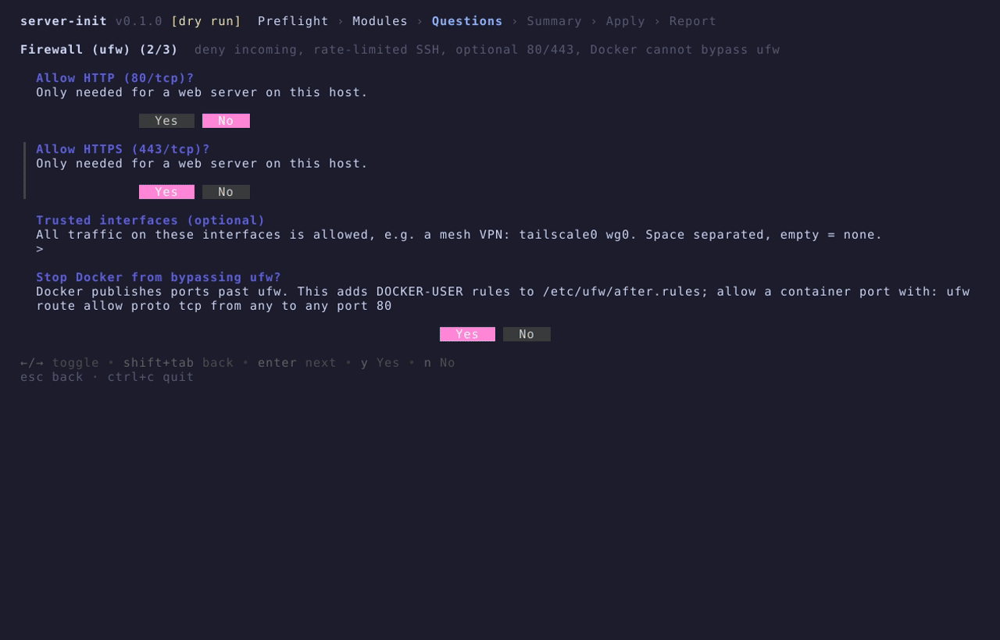
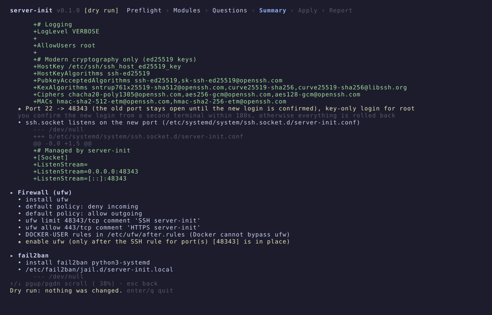
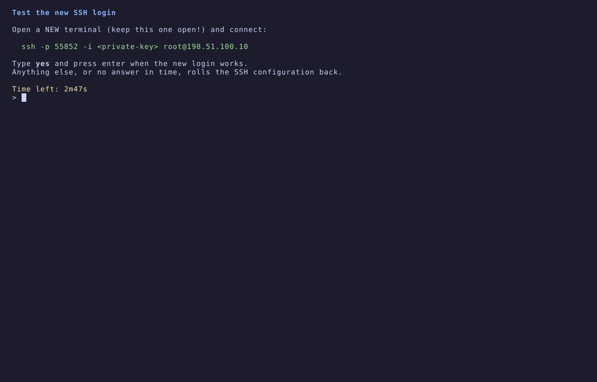
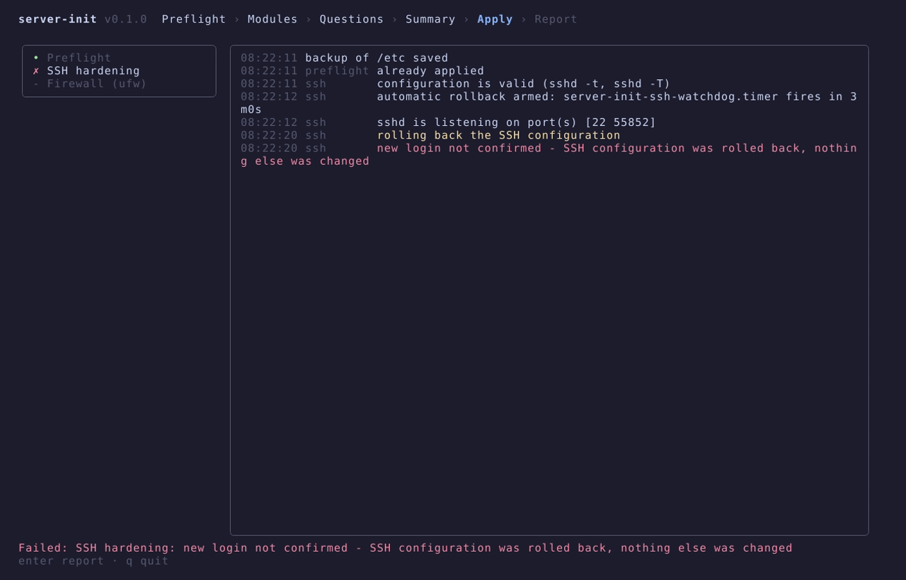

# server-init

Initial setup and hardening of a fresh **Debian 12+ / Ubuntu 24.04+** server in one terminal UI.
You answer a few questions, read every planned change, confirm, and watch it being applied.

- Single static binary (linux amd64), no runtime dependencies, runs as root
- Nothing changes before you confirm the summary (the default answer is **No**)
- SSH and the firewall are changed in a way that cannot lock you out
- Idempotent: running it again changes nothing that is already in place
- Every change is backed up and can be rolled back


> Keep your current SSH session open while server-init runs.

## Install

```bash
curl -fsSL https://raw.githubusercontent.com/Mimic890/server-init/main/install.sh -o install.sh
less install.sh            # read it first, it runs as root
sudo sh install.sh         # or: sudo VERSION=v0.1.0 sh install.sh
```

`install.sh` downloads the archive for your architecture from GitHub Releases, checks it against the
release's `checksums.txt` and installs `/usr/local/bin/server-init`.
You can also download the archive from the [releases page](https://github.com/Mimic890/server-init/releases) yourself.

## Usage

```bash
sudo server-init                         # main menu: full setup, custom setup, manage
sudo server-init --dry-run               # answer the questions, show every change, touch nothing
sudo server-init --only ssh,ufw          # custom setup with these modules preselected (preflight always runs)
sudo server-init --config answers.yaml   # non-interactive, all answers preset (asks y/N unless --yes)
sudo server-init --rollback              # restore /etc from the latest backup
sudo server-init --rollback ssh          # undo one module
sudo server-init ssh finalize            # close the old SSH port after a --config run (see below)
sudo server-init f2b status              # fail2ban management, see below
server-init --version
```

| Flag | Meaning |
|------|---------|
| `--only a,b` | Preselect these modules in the custom setup (they run in the fixed apply order). With `--config`: run only these modules. |
| `--dry-run` | Show the planned changes with file diffs. Works without root. Nothing is written. |
| `--config FILE` | Answers from YAML, no questions. See [`docs/answers.example.yaml`](docs/answers.example.yaml). |
| `--yes` | With `--config`: apply without the y/N confirmation (for automation). |
| `--rollback [module]` | Without a module: restore the `/etc` snapshot of the latest run. With a module: replay that module's journal backwards. |
| `--version` | Print the version. |

After every successful run the answers are saved to `/etc/server-init/answers.yaml` and used as defaults
next time, so a rerun with the same answers is a no-op.

## Screens

| Questions | Summary |
|-----------|---------|
|  |  |

| SSH login check | Automatic rollback when not confirmed |
|-----------------|----------------------------------------|
|  |  |

1. **Main menu**: the server at a glance (hostname, OS, IP, CPU, RAM, disk, uptime, SSH port(s), your IP)
   and the preflight checks (root, systemd). Then pick what to do:
   - **Full setup**: all modules, only the essential questions (hostname and timezone, admin user, SSH port
     and key, web ports, whitelisting your IP). Everything else keeps the recommended answer, and the summary
     still shows every change.
   - **Custom setup**: choose the modules and answer every question.
   - **Manage**: change one part later (SSH, admin user, firewall, fail2ban settings), show the fail2ban
     status, unban / whitelist / blacklist an IP, close the old SSH port after a `--config` run.
2. **Questions**: one form per module, every question has a default and a one-line explanation.
3. **Summary**: every planned change, including unified diffs of the files. Default answer: Cancel
   (back to the menu).
4. **Apply**: progress per module (spinner / ✓ / ✗) and a scrollable log.
5. **Report**: SSH port, user, key paths, firewall reminders, rollback commands.

## Modules

Modules always run in this order:

| Module | What it does |
|--------|--------------|
| `preflight` | Checks root, OS version, systemd, free disk, required tools, internet. Always runs. The `/etc` backup is made right before the first change. |
| `system` | `apt update` + `full-upgrade`; hostname, timezone, locale; NTP with systemd-timesyncd; unattended-upgrades limited to **security updates**, optional automatic reboot at a chosen time; base packages (curl, git, htop, btop, neovim, fish, zellij, ncdu, jq, unzip). |
| `cleanup` | Optional removal of snapd (with an apt pin), cloud-init, popularity-contest; Ubuntu MOTD news off; `apt autoremove --purge`, `apt clean`; journald `SystemMaxUse`. |
| `users` | Admin user (or keep root, key-only); sudo through a validated `/etc/sudoers.d` drop-in with or without password; groups sudo + optional docker/adm/systemd-journal; locks the root password and accounts with empty passwords; fixes home/`~/.ssh`/`authorized_keys` permissions; umask 027. |
| `ssh` | Key-only SSH, custom port, modern crypto, two-phase port change with an automatic rollback (details below). Port of [ssh-setting-script](https://github.com/Mimic890/ssh-setting-script). |
| `ufw` | Deny incoming / allow outgoing; SSH with `ufw limit`; optional 80/443 and trusted interfaces (mesh VPN); DOCKER-USER rules so Docker cannot bypass ufw. Enabled only once the SSH rule is in place. |
| `fail2ban` | `sshd` jail (aggressive mode, systemd backend, the real SSH port), optional `recidive`, permanent blacklist jail on all ports, whitelist with your current IP. |
| `sysctl` | BBR + fq; reverse path filter, no ICMP redirects, no source routing, SYN cookies, martian logging off; swap file if there is no swap; `vm.swappiness`. |

### SSH

All SSH settings go into one drop-in, `/etc/ssh/sshd_config.d/00-server-init.conf`. sshd uses the first value
it sees, and `00-` is read before other drop-ins (some cloud images turn passwords back on in a later file).

Always set: `PasswordAuthentication no`, `KbdInteractiveAuthentication no`, `AuthenticationMethods publickey`,
`PermitEmptyPasswords no`, `HostbasedAuthentication no`, `PermitUserEnvironment no`,
`PermitRootLogin prohibit-password` (`no` when you log in as another user), `MaxStartups 10:30:60`,
`LogLevel VERBOSE`, ed25519 host key only, and modern `KexAlgorithms` / `Ciphers` / `MACs`.
Algorithms your OpenSSH does not know are filtered out with `ssh -Q`.

Asked: port (random free port by default), login user, `AllowUsers`, `MaxAuthTries`, `LoginGraceTime`,
ClientAlive, X11 / TCP (`no` / `local` / `yes`) / agent forwarding, banner. The key is either pasted
(ed25519, the format is validated) or generated on the server. A generated private key can be shown once
and deleted after the login is confirmed.

**How the port change avoids lockouts**

1. Other `Port` lines are commented out (with a backup). Ubuntu's `ssh.socket` gets a drop-in for the ports.
2. sshd listens on the **old and the new port**. The config is checked with `sshd -t`, and the effective config
   with `sshd -T` (password login must really be off).
3. A systemd timer (`server-init-ssh-watchdog`) is armed. If the login is not confirmed within 180 s, it runs a
   self-contained rollback script, also when your connection or server-init dies.
4. You log in from a second terminal and type `yes`. Only then is the old port closed.

With `--config` there is nobody to confirm. For a key generated on the server, server-init tests the login
itself (`ssh -i … -p NEW user@127.0.0.1`). For a pasted key, both ports stay open until you have logged
in on the new port and run `sudo server-init ssh finalize`.

> Your hosting provider's firewall / security group is invisible to the server. Open the new port there too.

### fail2ban management

```bash
sudo server-init f2b status                     # jails, banned IPs, whitelist, blacklist
sudo server-init f2b unban 203.0.113.7
sudo server-init f2b unban-all
sudo server-init f2b whitelist add 203.0.113.0/24   # never banned
sudo server-init f2b whitelist del 203.0.113.0/24
sudo server-init f2b whitelist list
sudo server-init f2b blacklist add 198.51.100.9     # banned forever on all ports
sudo server-init f2b blacklist del 198.51.100.9
sudo server-init f2b blacklist list
sudo server-init f2b sync                       # reload fail2ban, re-apply the blacklist
```

### Coming from ssh-setup.sh

If a previous [ssh-setup.sh](https://github.com/Mimic890/ssh-setting-script) install is found, the ssh and
fail2ban modules take it over: its drop-ins and jails are backed up and replaced, and its whitelist and
blacklist are merged into `/etc/server-init/`.

## Files written

server-init prefers drop-in directories and never edits a main config when a drop-in works.
Every file is backed up before it is changed.

| Path | Module | Purpose |
|------|--------|---------|
| `/etc/ssh/sshd_config.d/00-server-init.conf` | ssh | SSH settings |
| `/etc/systemd/system/ssh.socket.d/server-init.conf` | ssh | Ports for socket-activated SSH (Ubuntu) |
| `/etc/ssh/server-init-banner` | ssh | Login banner (optional) |
| `/etc/ssh/sshd_config`, other `sshd_config.d/*.conf` | ssh | Active `Port` lines commented out |
| `/etc/sudoers.d/90-server-init-<user>` | users, ssh | sudo for the admin user |
| `/etc/login.defs` | users | `UMASK 027` (no drop-in exists) |
| `/usr/share/pam-configs/server-init-umask` | users | Enables `pam_umask` via `pam-auth-update` where it is missing (Debian) |
| `/etc/ufw/after.rules`, `after6.rules` | ufw | DOCKER-USER block (no drop-in exists) |
| `/etc/fail2ban/jail.d/server-init.local`, `server-init-whitelist.local` | fail2ban | Jails and whitelist |
| `/etc/fail2ban/fail2ban.d/server-init.local` | fail2ban | `dbpurgeage` for permanent bans |
| `/etc/fail2ban/filter.d/server-init-blacklist.conf` | fail2ban | Filter of the blacklist jail |
| `/etc/server-init/{whitelist,blacklist}.list` | fail2ban | Lists managed with `server-init f2b` |
| `/etc/sysctl.d/99-server-init.conf` | sysctl | Kernel settings |
| `/etc/modules-load.d/server-init.conf` | sysctl | Load `tcp_bbr` at boot |
| `/swapfile`, `/etc/fstab` (marked block) | sysctl | Swap file |
| `/etc/apt/apt.conf.d/20auto-upgrades`, `52server-init-unattended` | system | Security-only automatic updates |
| `/etc/hosts`, `/etc/default/locale`, `/etc/locale.gen` | system | Hostname, locale |
| `/usr/local/bin/zellij` | system | zellij (not packaged by Debian/Ubuntu; sha256-verified GitHub release) |
| `/etc/systemd/journald.conf.d/server-init.conf` | cleanup | Journal size |
| `/etc/apt/preferences.d/server-init-no-snapd` | cleanup | Keeps snapd from coming back |
| `/etc/default/motd-news` | cleanup | MOTD news off |
| `/etc/server-init/answers.yaml` | - | Answers of the last successful run |
| `/var/lib/server-init/backup-<timestamp>/` | - | `/etc/{ssh,ufw,fail2ban,sudoers.d,sysctl.d}` snapshot and per-file backups |
| `/var/lib/server-init/state/<module>.json` | - | What each module changed (rollback journal) |
| `/var/lib/server-init/rollback-ssh.sh` | ssh | Script run by the SSH watchdog |
| `/var/log/server-init.log` | - | Everything server-init did, including every command |

## Rollback

- `sudo server-init --rollback ssh` (or any module) replays that module's journal backwards: created files
  are removed, changed files restored, recorded commands undone (rules deleted, timers re-enabled, …), and
  the affected services are restarted. Rolling back `ssh` first opens the restored port in an active firewall.
- `sudo server-init --rollback` restores `/etc/{ssh,ufw,fail2ban,sudoers.d,sysctl.d}` from the snapshot of the
  latest run, then restarts sshd, ufw, fail2ban and reloads sysctl.
- Kept on purpose: installed or purged packages, upgrades, created users (SSH may only allow that user), and
  SSH keys added to `authorized_keys`.

## Safety rules

- Nothing is applied before the summary is confirmed. The default answer is No.
- Every change goes through one layer that has a dry-run mode. `--dry-run` only reads.
- Drop-ins instead of main configs. Every file is backed up before it changes.
- Idempotent: each module compares the wanted state with the host, and an empty plan means nothing to do.
- SSH never locks you out: old and new port during the change, a timer-based automatic rollback, and an
  `sshd -T` check that passwords are really off.
- ufw is enabled only after re-reading its rules and finding the SSH rule. firewalld or custom DROP rules are
  detected and left alone.

## Development

```bash
go test ./...                         # unit tests, golden files in testdata/ (update: go test ./... -update)
golangci-lint run ./...
go build -o server-init ./cmd/server-init

# integration test: a systemd container per distribution
docker build -t si-test --build-arg BASE=debian:12 test/integration
CGO_ENABLED=0 go build -o server-init ./cmd/server-init
test/integration/run.sh si-test ./server-init
```

The integration test runs the full set of modules with
[`test/integration/answers.yaml`](test/integration/answers.yaml). It checks:

- `--dry-run` leaves `/etc` byte-identical;
- an SSH login with the generated key works, password and root logins are refused;
- `sudo` works and the umask is 027 in an SSH session;
- ufw, fail2ban (including the CLI), sysctl and unattended-upgrades are set up as configured;
- a rerun reports "Everything is already applied";
- the module rollbacks and the global rollback work.

CI runs it on Debian 12 and Ubuntu 24.04.

Layout:

```
cmd/server-init/       entrypoint, flags, subcommands
internal/sys/          host access (commands, files, diffs), real and dry-run
internal/state/        backups, /etc snapshot, per-module journal
internal/module/       Module interface, Plan, Env, registry
internal/modules/<x>/  one package per module
internal/runner/       prepare -> check -> apply with progress events
internal/tui/          Bubble Tea screens, plain mode for --config
internal/config/       answers, defaults, YAML
internal/facts/        preflight facts
internal/log/          /var/log/server-init.log
```

The GIF and screenshots are rendered with [vhs](https://github.com/charmbracelet/vhs) from `docs/vhs/*.tape`.

## License

[MIT](LICENSE)
